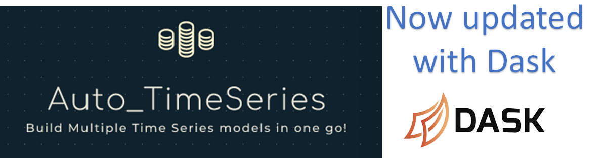

# Auto_TimeSeries
Automatically build multiple Time Series models with a single line of code

####################################################################################
####                          Auto Time Series                                  ####
####                           Version 0.0.19 Version                           ####
####                    Conceived and Developed by Ram Seshadri                 ####
####                        All Rights Reserved                                 ####
####################################################################################
AUTO_TIMESERIES IS A COMPLEX MODEL BUILDING UTILITY FOR TIME SERIES DATA. SINCE IT AUTOMATES MANY
TASKS INVOLVED IN A COMPLEX ENDEAVOR, IT ASSUMES MANY INTELLIGENT DEFAULTS. BUT YOU CAN CHANGE THEM.
Auto_Timeseries will rapidly build predictive models based on Statsmodels ARIMA, Seasonal ARIMA
and Scikit-Learn ML. It will automatically select the BEST model which gives best score specified.
It will return the best model and a dataframe containing predictions for forecast_period (default=2). 
####################################################################################
 
INPUT: 
####################################################################################> 
trainfile: name of the file along with its data path or a dataframe. It accepts both. 
ts_column: name of the datetime column in your dataset (it could be name or number) 
target: name of the column you are trying to predict. Target could also be the only column in your data  
score_type: 'rmse' is the default. You can choose among "mae", "mse" and "rmse".  
forecast_period: default is 2. How many periods out do you want to forecast? It should be an integer  
time_interval: default is "Month". What is the time period in your data set. Options are: "day", 
'month','week','year','quarter' etc.  
model_type: default is "stats". Choice is between "stats", "prophet" and "ml". "All" will build all.  
    - "stats" will build statsmodels based ARIMA< SARIMAX and VAR models  
    - "ml" will build a machine learning model using Random Forests provided explanatory vars are given  
    - "prophet" will build a model using FB Prophet -> this means you must have FB Prophet installed  
    - "best" will build three of the best models from above which might take some time for large data sets.  
####################################################################################
 
We recommend that you choose a small sample from your data set before attempting to run entire data.
and the evaluation metric so it can select the best model. Currently only 2 are supported: RMSE and
Normalized RMSE (ratio of RMSE to the standard deviation of actuals). Other eval metrics will be soon.
the target variable you are trying to predict (if there is more than one variable in your data set),
and the time interval that is in the data. If your data is in a different time interval than given, 
Auto_Timeseries will automatically resample your data to the given time interval and learn to make
predictions. Notice that except for filename and ts_column which are required, all others are optional.  
Note that optionally you can give a separator for the data in your file. Default is comman (","). 
"time_interval" options are: 'Days', 'Weeks', 'Months', 'Qtr', 'Year', 'Minutes', 'Hours', 'Seconds'.
Optionally, you can give seasonal_period as any integer that measures the seasonality in the data.
If not, seasonal_period is assumed automatically as follows: Months = 12, Days = 30, Weeks = 52,
Qtr = 4, Year = 1, Hours = 24, Minutes = 60 and Seconds = 60. 
If you want to give your own order, please input it as non_seasonal_pdq and seasonal_PDQ in the input
as tuples. For example, seasonal_PDQ = (2,1,2) and non_seasonal_pdq = (0,0,3). It will accept only tuples.
The default is None and Auto_Timeseries will automatically search for the best p,d,q (for Non Seasonal)
and P, D, Q (for Seasonal) orders by searching for all parameters from 0 to 12 for each value of
p,d,q and 0-3 for each P, Q and 0-1 for D.
####################################################################################
