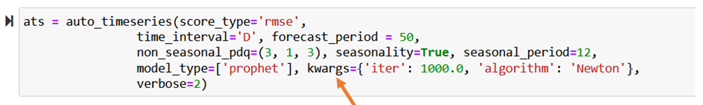

<h1 id="updates">Latest Updates about Auto_TS library Page:</h1>

<h2 id="jan-update">January 2024 Update:</h2>

We have now added `XGBoost with GPU` support to Auto_TS. Auto_TS will automatically detect if there is a GPU in your Kaggle kernel or your local machine and will run XGBoost with GPU support. Hope this speeds up your computations!. 

<h2 id="nov-update">November 2023 Update:</h2>

We have now added `Google Cloud Run` support to Auto_TS. You can simply use the instructions in this <a href="https://github.com/AutoViML/Auto_TS/blob/master/cloud_run.txt">page</a> to deploy Auto_TS models on Google Cloud Run. Many thanks to <a href="https://github.com/abdulrahman305"> abdulrahman305</a> for providing a Pull Request to add this functionality to Auto_TS.  

<h2 id="mar-update">March 2023 Update:</h2>

We have now upgraded `FB Prophet` to the latest version which is simply called `prophet`.  

<h2 id="aug-update">Aug 2022 Update:</h2>

You can now add FB Prophet arguments directly into Auto_TimeSeries using the kwargs argument. See example below:

<h2 id="jan-update">Jan 2022 Update:</h2>
New since version 0.0.35: You can now load your file into a Dask dataframe automatically. Just provide the name of your file and if it is too large to fit into a pandas dataframe, Auto_TS will automatically detect and load it into a Dask dataframe.

